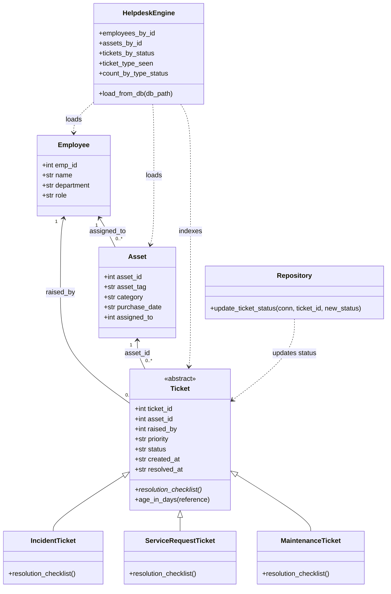
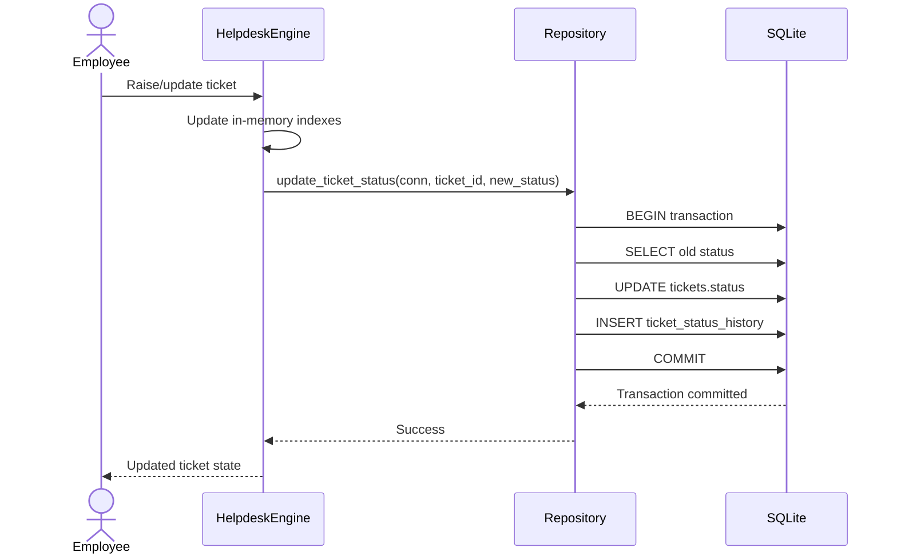

# SentinelDesk — HLD/LLD & Scale-Readiness Design

## 1. High-Level Design

SentinelDesk is organized as a layered architecture:

```text
Presentation
    |
Business
    |
Data Access
    |
Database
```

### Presentation layer

This project does not contain a browser UI. The minimal presentation surface is the command-line usage documented in `README.md`, including `engine.py` validation and `run_concurrency_experiment.py` experiment output. These scripts expose the behavior of the system without introducing a separate web framework.

### Business layer

The business/domain layer is implemented in `engine.py`.

Its principal classes are:

- `Ticket`
- `IncidentTicket`
- `ServiceRequestTicket`
- `MaintenanceTicket`
- `Employee`
- `Asset`
- `HelpdeskEngine`

`Ticket` defines the common ticket contract and the abstract `resolution_checklist()` operation. The three ticket subclasses provide ticket-type-specific resolution behavior. `HelpdeskEngine` loads persistent data and builds the in-memory lookup structures required by Part 1.

### Data Access layer

The data-access layer is implemented by `Repository` in `repository.py`.

`Repository.update_ticket_status()` is responsible for the transactional status-write path. The SQL files under `reports/` are also data-access artifacts because they contain the reporting queries executed against SQLite.

### Database layer

The database layer is represented by `schema.sql` and the SQLite database created from it.

The schema contains:

- `employees`
- `assets`
- `tickets`
- `ticket_status_history`

`seed_data.sql` initializes the required reproducible dataset.

### Layer mapping

```text
Presentation
  README-driven CLI usage
  engine.py test entry point
  run_concurrency_experiment.py
          |
          v
Business
  HelpdeskEngine
  Ticket
  IncidentTicket
  ServiceRequestTicket
  MaintenanceTicket
  Employee
  Asset
          |
          v
Data Access
  Repository
  reports/*.sql
          |
          v
Database
  schema.sql
  SQLite database
```

## 2. Low-Level Design — SOLID Principles

### Ticket — Single Responsibility Principle (SRP)

`Ticket` owns the common state and contract for a helpdesk ticket, including identifiers, priority, status, dates, and the abstract resolution checklist. It does not perform SQLite persistence, so database concerns remain outside the domain object.

### IncidentTicket — Open/Closed Principle (OCP)

`IncidentTicket` specializes `Ticket` by overriding `resolution_checklist()` with incident-specific investigation, triage, root-cause, and verification steps. New incident behavior can be introduced by extending the class implementation without changing the base `Ticket` contract used by `notify()`.

### HelpdeskEngine — Dependency Inversion Principle (DIP)

`HelpdeskEngine` concentrates the in-memory indexing behavior and exposes `load_from_db()` as the boundary where persistent data enters the engine. Keeping database loading in one method prevents the rest of the engine's lookup logic from depending directly on SQL statements or database cursors.

### Repository — Single Responsibility Principle (SRP)

`Repository` owns the transactional write operation that changes a ticket status and records the corresponding history row. It does not own ticket classification or in-memory indexing, so those responsibilities remain in `Ticket` subclasses and `HelpdeskEngine`.

### Employee — Interface Segregation Principle (ISP)

`Employee` is a small data object containing only employee identity and organizational attributes needed by the system. It does not implement ticket, asset, persistence, or reporting operations that an employee object does not need.

## 3. Class Diagram



## 4. Sequence Diagram

The persistence flow for a ticket-status update is:



The repository operation keeps the ticket update and history insert in one transaction. If either statement fails, `Repository.update_ticket_status()` rolls back the transaction.

## 5. Scale-Readiness

### Horizontal vs. vertical scaling

As SentinelDesk ticket volume grows, the `tickets` table and ticket reporting queries become the first area to watch because the reporting workload groups and ranks ticket rows repeatedly. The Task 4 reports perform aggregations over `tickets`, and Task 5 specifically measures the `(ticket_type, status)` grouping query; therefore the database/query layer is the first bottleneck to address before simply adding application instances. Vertical scaling can increase SQLite resources on one host, but a larger deployment would eventually require a server database with stronger concurrent-write capacity and read replicas or partitioning where justified.

### Load balancing

A **Least Connection** load-balancing algorithm fits a stateless HTTP version of SentinelDesk because requests can be routed to the instance with the fewest active connections. Statelessness matters because `HelpdeskEngine`'s in-memory indexes are a cache/indexing layer rather than the source of truth; persistent ticket and asset state remains in the database, so another application instance can serve the next request without requiring a user's session or ticket state to be pinned to one server.

### Microservices decomposition

A concrete split would separate **Asset Management** from **Ticket Management**.

The Asset Management service would own the `assets` table as its source of truth, while the Ticket Management service would own `tickets` and `ticket_status_history`. The consistency challenge is that a ticket references an asset, so a distributed service boundary removes the simple local foreign-key guarantee between the two domains.

The ownership rule would therefore be: Asset Management owns asset identity and lifecycle, while Ticket Management stores an `asset_id` reference and validates asset existence through a service/API contract or replicated reference data. Events such as `AssetCreated` and `AssetRetired` could synchronize the reference state, with the trade-off that cross-service consistency becomes eventual rather than a single SQLite transaction.

